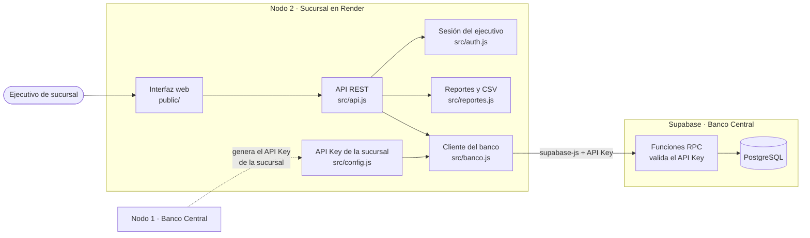

# Nodo 2 · Servidor administrativo de sucursal

Sistema para los ejecutivos de una sucursal del **Sistema Bancario Distribuido**
(Examen 2 Práctico): abre cuentas de clientes, consulta historiales y emite reportes.

## Enlaces

| Nodo | Aplicación desplegada | Tecnología |
|---|---|---|
| 1 · Banco Central | https://examen2-tawd-nodo1.onrender.com | Laravel + Supabase |
| **2 · Sucursal** | https://examen2-tawd-nodo2.onrender.com | Express |
| 3 · Cajero automático | https://examen2-tawd-nodo3.onrender.com | Express |

La aplicación está en el plan gratuito de Render: si lleva un rato sin uso, la primera
carga tarda cerca de un minuto.

## Arquitectura del nodo

La sucursal no tiene base de datos. Cada operación se envía al Banco Central (Supabase)
como una llamada a función, identificándose con el API Key de la sucursal.



| Función | Pantalla | Ruta del nodo | Función en el Banco Central |
|---|---|---|---|
| Crear cuentas de clientes | Cuentas | `POST /api/cuentas` | `crear_cuenta` |
| Listar cuentas de la sucursal | Cuentas | `GET /api/cuentas` | `cuentas_de_sucursal` |
| Historial local | Historial | `GET /api/historial` | `historial` |
| Historial por usuario | Historial | `GET /api/historial?cuenta=` | `historial`, `consultar_saldo` |
| Reportes (CSV y PDF) | Reportes | `GET /api/reportes` | `historial`, `cuentas_de_sucursal`, `nodo_info` |
| Conexión por API Key | Configuración | `PUT /api/config/api-key` | `nodo_info` |

### Cómo se conecta con el banco

1. El administrador crea la sucursal en el nodo 1 y obtiene su API Key (`bk_suc_…`).
2. El API Key se define en la variable `BANCO_API_KEY` o se captura en la pantalla
   Configuración. El nodo lo verifica contra el banco y rechaza los que son de cajero.
3. A partir de ahí, cada operación viaja con ese API Key. Si el banco desactiva la
   sucursal, todas las operaciones se rechazan de inmediato.

Una sucursal solo ve las cuentas que abrió ella y las operaciones hechas en ella.

## OpenAPI

[`openapi.yaml`](openapi.yaml) documenta las rutas de este servidor: sesión, cuentas,
historial, reportes y configuración del API Key.

Para verlo como documentación interactiva, abrir https://editor.swagger.io y pegar el
contenido del archivo.

## Despliegue

Web Service de Node en Render, con despliegue automático en cada `git push` a `main`.

| Paso | Valor |
|---|---|
| Construcción | `npm install` |
| Arranque | `npm start` |

Variables de entorno: `SUPABASE_URL`, `SUPABASE_ANON_KEY`, `BANCO_API_KEY`,
`SUCURSAL_USUARIO`, `SUCURSAL_PASSWORD`, `SESSION_SECRET`.

El pipeline completo y el flujo entre los tres nodos están explicados en el README del nodo 1.

## Ejecución local

Requiere Node 20 o superior.

```bash
npm install
cp .env.example .env
npm start
```

Abrir http://localhost:3000.